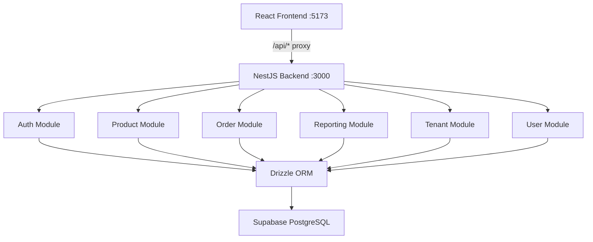

# Backend Implementation Walkthrough

## What Was Built

A **NestJS modular monolith** backend at [backend/](file:///Users/ammarfarghani/Documents/Source%20Codes/POS-portfolio/backend), implementing all 11 API endpoints from the [API contract](file:///Users/ammarfarghani/Documents/Source%20Codes/POS-portfolio/docs/phase_1_api_contract.md).

### Architecture



---

### API Endpoints (11 total)

| # | Method | Endpoint | Auth | Module |
|---|--------|----------|------|--------|
| 1 | POST | `/api/v1/auth/login` | Public | Auth |
| 2 | GET | `/api/v1/categories` | JWT | Product |
| 3 | GET | `/api/v1/products` | JWT | Product |
| 4 | POST | `/api/v1/products` | Admin | Product |
| 5 | PUT | `/api/v1/products/:id` | Admin | Product |
| 6 | DELETE | `/api/v1/products/:id` | Admin | Product |
| 7 | POST | `/api/v1/orders` | JWT | Order |
| 8 | GET | `/api/v1/orders` | JWT | Order |
| 9 | GET | `/api/v1/analytics/summary` | JWT | Reporting |
| 10 | GET | `/api/v1/analytics/top-products` | JWT | Reporting |
| 11 | GET | `/api/v1/reports/sales` | JWT | Reporting |

---

### Database Schema (6 tables)

| Table | Purpose |
|-------|---------|
| `tenants` | Multi-tenant store isolation |
| `users` | Admin & Cashier accounts with bcrypt hashed passwords |
| `categories` | Product categories (icon, color, name) |
| `products` | Menu items with price, stock, image URL |
| `orders` | Completed orders with payment method & status |
| `order_items` | Line items capturing quantity & price at time of order |

---

### Key Features

- **Transactional stock deduction**: Orders atomically create the order, insert items, and deduct product stock in a single DB transaction
- **Pre-submission stock validation**: Checks all products have sufficient stock before attempting the order
- **JWT authentication**: 24h tokens with `user_id`, `tenant_id`, `role` claims
- **Role-based access**: `@Roles('ADMIN')` decorator + `RolesGuard` for admin-only endpoints
- **Tenant scoping**: All queries automatically filter by `tenant_id` from JWT
- **Structured errors**: Global exception filter returns `{ code, message, statusCode }`
- **Sentry Integration**: Global error tracking and performance monitoring enabled via `@sentry/nestjs`.
- **Swagger**: Full API documentation at `/api/docs`

---

## Getting Started

### 1. Set up environment variables

```bash
cp backend/.env.example backend/.env
# Edit backend/.env with your Supabase DATABASE_URL, JWT_SECRET, and SENTRY_DSN
```

### 2. Push schema to Supabase

```bash
cd backend && npm run db:push
```

### 3. Seed demo data

```bash
cd backend && npm run db:seed
```

### 4. Start the backend

```bash
cd backend && npm run start:dev
```

### 5. Test login

```bash
curl -X POST http://localhost:3000/api/v1/auth/login \
  -H "Content-Type: application/json" \
  -d '{"email":"admin@example.com","password":"password123"}'
```

### Demo accounts (seeded)

| Role | Email | Password |
|------|-------|----------|
| Admin | `admin@example.com` | `password123` |
| Cashier | `cashier@example.com` | `password123` |